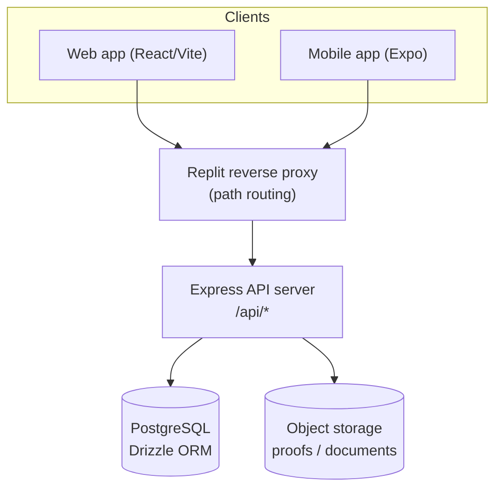
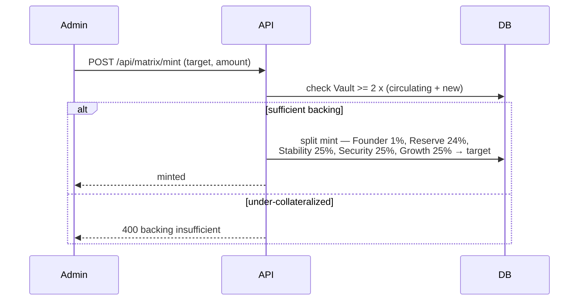
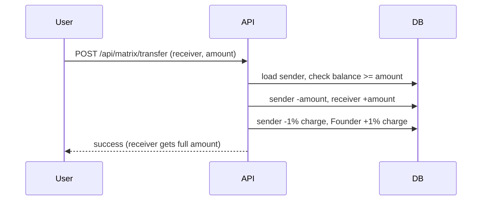
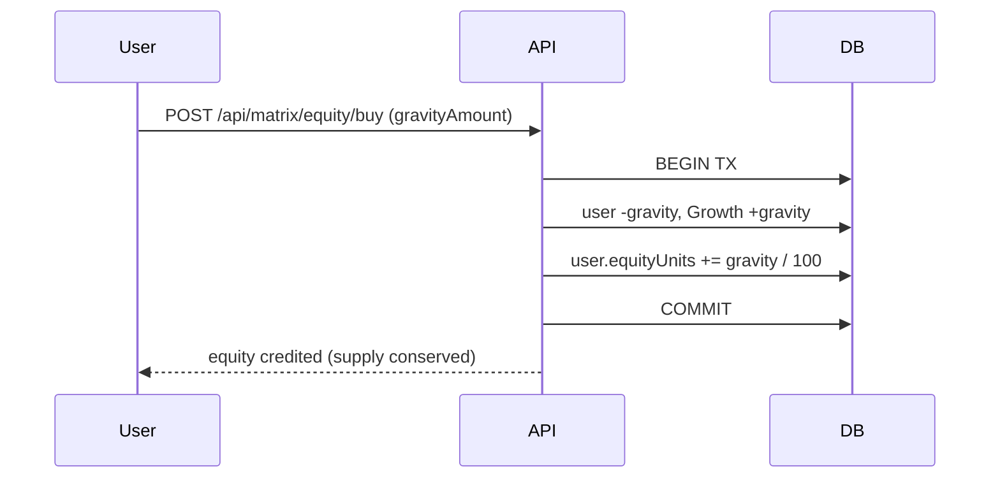
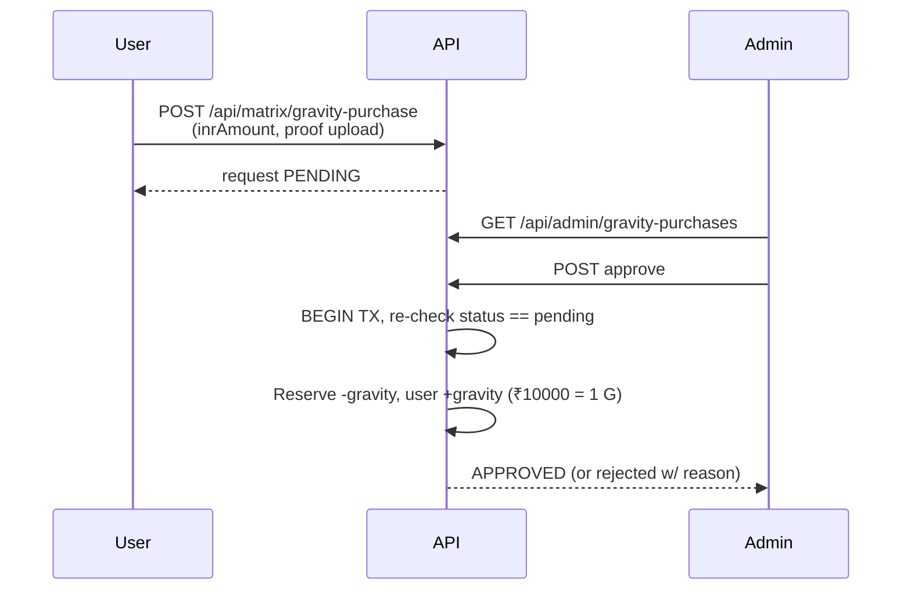
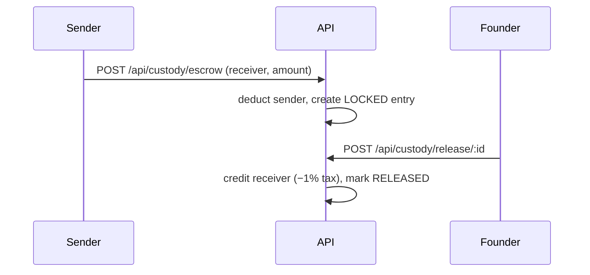

# Black Universe — System Architecture

> Technical reference for engineers. Describes what the platform does, how value
> moves through it, the data model, the security model, and how to scale it.

## 1. What it is

Black Universe is an asset-backed digital-currency platform. Users ("citizens")
hold **Gravity** — the internal unit of account, pegged at **₹10,000 = 1 Gravity**.
Gravity is created ("minted") only against custodied real-world assets held in a
**Vault**, and circulates between citizen wallets and a set of **system pool
accounts**. Citizens can also convert Gravity into **Black Universe Equity**.

## 2. Tech stack

| Layer        | Technology                                             |
| ------------ | ------------------------------------------------------ |
| Monorepo     | pnpm workspaces, TypeScript 5.9, Node 24               |
| API server   | Express 5 (`artifacts/api-server`)                     |
| Database     | PostgreSQL + Drizzle ORM (`lib/db`)                    |
| Validation   | Zod (`zod/v4`), `drizzle-zod`                          |
| Web client   | React + Vite (`artifacts/asset-verify`), served at `/` |
| Mobile       | Expo / React Native (`artifacts/mobile`)              |
| Object store | Replit App Storage (payment proofs, asset documents)   |
| Sessions     | `express-session` + `connect-pg-simple` (Postgres)     |

## 3. High-level architecture

## 4. Core concepts

- **Gravity** — the currency. Stored as `numeric(30,6)` (no floating-point drift).
- **Equity** — Black Universe Equity units; bought with Gravity at
  `EQUITY_PRICE_GRAVITY = 100` Gravity per unit.
- **Matrix accounts** — every wallet (citizen or system) is a row in
  `matrix_accounts` keyed by a 12-digit `account_number`.
- **System pool accounts** (reserved numbers):

  | Account        | Number         | Role                                  |
  | -------------- | -------------- | ------------------------------------- |
  | System Main    | `000000000000` | Genesis / system root                 |
  | Vault          | `000000000001` | Holds Gravity backing custodied assets|
  | Founder        | `111111111111` | Receives the 1% founder cut           |
  | Reserve        | `222222222222` | Liquidity for INR→Gravity exchange    |
  | Growth         | `555555555555` | Receives Gravity spent on Equity      |

- **Backing ratio** — `VAULT_BACKING_RATIO = 2`: the Vault must hold ≥ 200% of
  circulating Gravity before new Gravity can be minted.

## 5. Money flows

### 5.1 Mint (admin/founder only)

### 5.2 P2P transfer (citizen)

> The 1% charge is deducted **separately** from the sender (receiver always gets
> the full amount). See §7 for the atomicity caveat.

### 5.3 Buy Equity (citizen)

### 5.4 INR → Gravity exchange (manual, admin-approved)

> The platform never touches the rupees: the citizen pays the bank account shown
> on the gateway directly, uploads proof, and an admin verifies + credits.

### 5.5 Escrow (founder-released P2P)

## 6. Auth & authorization model

- **Sessions:** `express-session` backed by Postgres (`connect-pg-simple`). A
  `Bearer` token bridge exists for the mobile app.
- **`requireAuth` / `requireSession`:** any logged-in citizen.
- **`requireAdmin` / `isFounder`:** role `admin` / the Founder account.
- **State-mutating endpoints open to any citizen:** asset submission, P2P
  transfer, equity buy, gravity-purchase request, custody lock, escrow.
- **Admin-only:** mint, asset approval/deposit, gravity-purchase approve/reject,
  gateway settings, full vault view, escrow release.

## 7. Known risks / hardening backlog

These are tracked so a reviewer understands the current state (see the security
audit for severities and fixes):

1. **Transfer is not wrapped in a DB transaction** — the balance check and the
   four `adjustBalance` writes are sequential, so concurrent transfers from the
   same wallet can race past the balance check.
2. **`adjustBalance` allows negative balances** — no floor at the engine level;
   the 1% charge can push a wallet into "overage" (negative).
3. **`POST /api/custody/lock` is open to any citizen** with arbitrary
   `ownerAccount` and `valuation` — pollutes the custody ledger.
4. **`custody/release` credit + status update are not atomic** — an admin retry
   after a partial failure can double-credit the receiver.
5. **Admins can pass `senderAccount`** on transfer to move funds from any
   account — a compromised admin can drain the ledger.

## 8. Scaling notes (Replit → production)

- **Statelessness:** the API is already mostly stateless (sessions live in
  Postgres), so it can run behind a load balancer with N replicas.
- **Database:** the single biggest scaling axis. Use a managed Postgres
  (RDS / Cloud SQL) with a connection pooler (PgBouncer) and read replicas for
  the heavy read paths (`/matrix/accounts`, transaction history).
- **Hot rows:** the system pool accounts (Founder, Reserve, Growth) are written
  on nearly every transaction and will become lock-hotspots. Batch/queue these
  writes or aggregate fee postings.
- **Money correctness first:** wrap every multi-write money path in a single DB
  transaction with `SELECT … FOR UPDATE` (or atomic conditional updates) before
  scaling horizontally — otherwise more replicas just multiply the race window.
- **Async heavy work:** asset verification, notifications, and proof processing
  belong on a queue (SQS / Cloud Tasks), not in the request path.

## 9. Repo map

| Path                                         | Purpose                          |
| -------------------------------------------- | -------------------------------- |
| `artifacts/api-server/src/lib/matrixEngine.ts` | Constants, mint, balance helpers |
| `artifacts/api-server/src/routes/matrix.ts`  | Wallet, transfer, equity, exchange |
| `artifacts/api-server/src/routes/admin.ts`   | Admin approvals & settings       |
| `artifacts/api-server/src/routes/custody.ts` | Vault custody & escrow           |
| `artifacts/api-server/src/routes/assets.ts`  | Asset submission                 |
| `lib/db/src/schema/`                         | Drizzle schema (source of truth) |
| `artifacts/asset-verify/src/pages/`          | Web UI (matrix, admin)           |
| `scripts/stress-test.mjs`                    | Load / stress test harness       |
